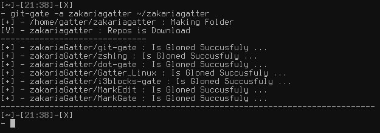
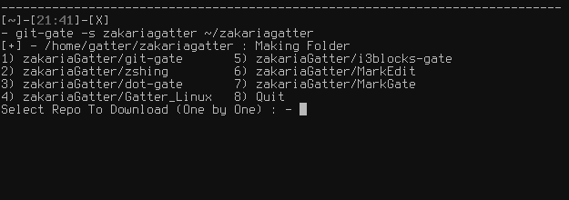
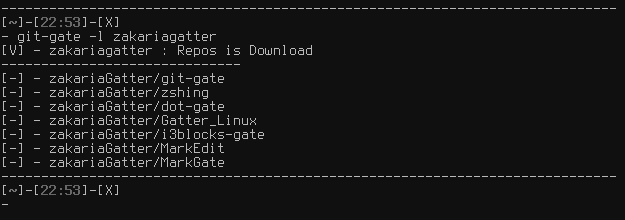

# git-gate

## About
[Git-gate] Clone all User GitHub Repos or select some of them

[Git-gate] allows you to ...

* Clone All User GitHub Repos to special Directory
* Select One or multi Repos to Clone
* use dmenu to select
* List all user Repos
* Update git directory on or multi
* Back up yous git repos Dir

[Git-gate] automatically ...

* Check for The User Exist
* Check If the network is running
* Check for the output Directory
* Send a Notification when Repos Cloned

## Screenshot




## Quick start

1. Requires :

    Installation requires:

	* __Git__       : Clone GitHub Repos
	* __Curl__      : Get all User Repos from github.com
	* __Dmenu__     : Select Repos with -d flag
	* __Zip__       : Backup option
	* __Dialog__	: Select Repos with -s flog


2. Set up [Git-gate]:

    ```bash
	git clone https://gitlab.com/zakariagatter/git-gate.git ~/git-gate
	mkdir -p ~/.local/bin
	cp ~/git-gate/git-gate ~/.local/bin
    ```

## Using Git-gate
```
    GIT-GATE (0.2) - 2019-02-12
    Writing by Zakaria GATTER (github.com/zakariagatter)

    SYNTAX :
	git-gate [OPTS] USERNAME DIRECTORY

    OPTS :
        -a | --all	: Download all User Repos
        -s | --select   : Select one or multi Repos to Download using whiptail
        -d | --dmenu    : Select one Repos with dmenu
        -o | --only-one : git clone one repo
        -l | --list	: Show Repos List
        -u | --update   : Update All Git Repos in Givin DIRECTORY
        -b | --backup   : Backup Your git Repos
        -h | --help	: Display This Message

    NOTE :
        - if leave DIRECTORY empty in [-a|-s|-d|-o] git-gate will take $HOME/Git as default directory
```

## TODO
[Git-gate] is still work on new idea and functions

* [X] Clone All User Repos
* [X] Select one or Multi Repos to Clone
* [X] Use Dmenu to select
* [X] Send Notification when a repo Cloned
* [X] View Repos List
* [X] Update Git Repos
* [X] Git clone Only on repo
* [X] Get All repos from Miltu page List


[Git-gate]:https://gitlab.com/zakariagatter/git-gate
